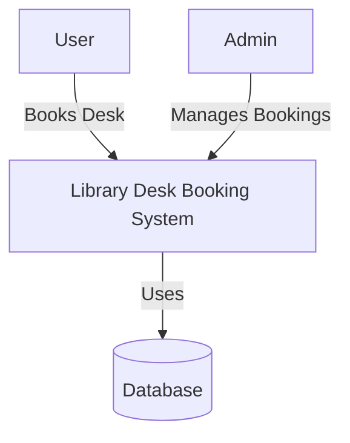
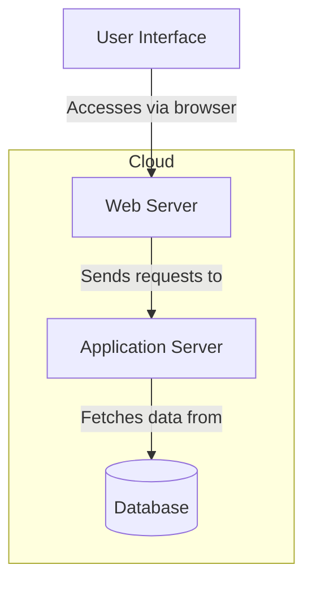
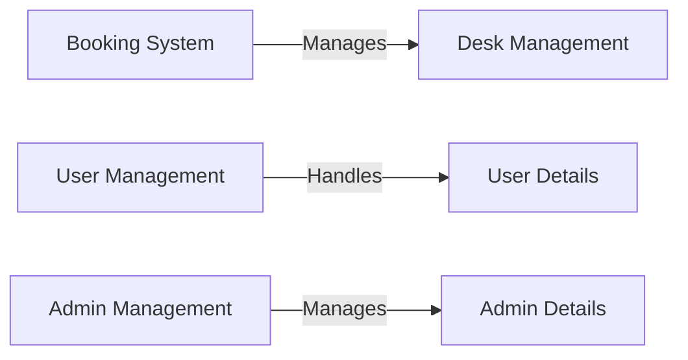
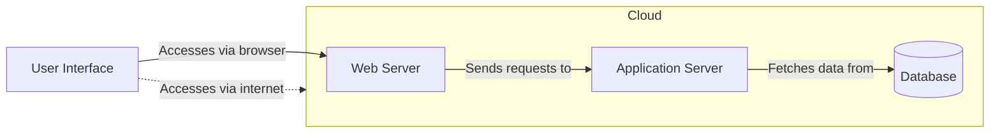

# Architecture Design - Library Desk Booking System

## 1. Introduction

### Project Title: Library Desk Booking System 

### Domain: Library Management System
- **Description**: The system is designed to streamline the desk reservation process in libraries.

### Problem Statement
Manual desk reservations can lead to mistakes and inefficiencies. This system automates the process to improve usability and desk management.

### Scope
The scope of this project includes:
- **User functionality**: Allowing users to view available desks, make bookings, and cancel reservations.
- **Admin functionality**: Enabling administrators to manage desk availability, view reservations, and cancel or modify bookings.
- **Feasibility justification**: The project is feasible within the constraints of the system's scope, and the necessary technologies (Java, SQL) are suitable for the system's requirements. The implementation will be scalable and adaptable to various library sizes and desk arrangements.

## 2. C4 Diagrams

### 2.1 Context Diagram
Shows interactions between the user, admin, system, and database.

- The **Library Desk Booking System** interacts with:
  - Users (Library visitors)
  - Admin (Library staff)
  - Database (SQL database for storing desk and user information)
    

### 2.2 Container Diagram
Describes the system architecture components (backend, frontend, and database).
The system architecture is divided into three main components:

- **Backend**: The system’s backend is responsible for managing user requests, booking desks, and storing data.
- **Frontend**: The client-side interface allows users and admins to interact with the system.
- **Database**: Stores user information, desk availability, and bookings.

### 2.3 Component Diagram
Shows individual system components like the booking system, user management, and admin management.
- **Booking System**: Handles desk reservations.
- **User Management**: Manages user authentication and registration.
- **Admin Management**: Admins can manage desks and bookings.
  

### 2.4 Deployment Diagram
Demonstrates how the system will be deployed and how components interact with each other.

