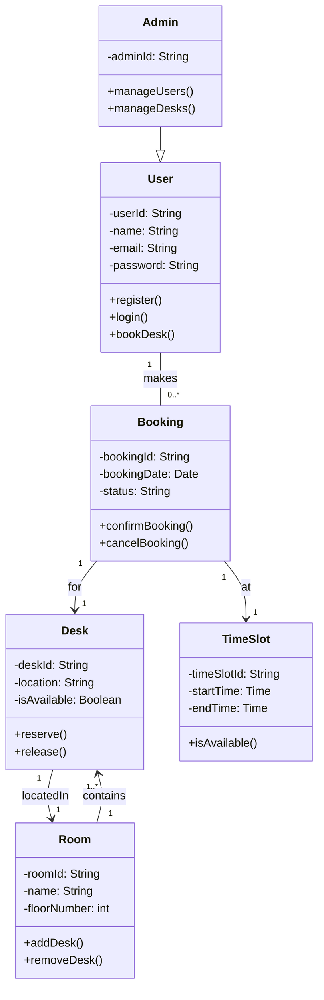

##  Class Diagram: Library Desk Booking System

##  Brief Explanation of Key Design Decisions

1. **User and Admin Inheritance**  
   The Admin class inherits from User to reflect that admins are also users but with additional privileges like managing desks and users. This promotes **code reuse and separation of roles** in the system.

2. **Clear Relationships and Multiplicity**  
   Each User can make multiple Bookings (`1..*`), but a Booking is linked to only one Desk and one TimeSlot. This enforces clear **one-to-many** and **one-to-one** relationships that align with real-world booking logic.

3. **Encapsulation and Clarity**  
   Class attributes are private (`-`) while methods are public (`+`) to follow **object-oriented programming principles**. This helps encapsulate internal logic and exposes only relevant operations for interaction.

4. **Dedicated TimeSlot Class**  
   A separate TimeSlot class was introduced to allow better control over time-based logic, such as checking availability and managing dynamic scheduling, making the system **more scalable and maintainable**.

5. **Room–Desk Composition**  
   Room and Desk are modeled with a composition relationship where a Room contains one or more Desks. This reflects the **physical layout of a library** and supports filtering desks by room or floor in future enhancements.

6. **Business Logic Alignment**  
   Methods like bookDesk(), confirmBooking(), reserve(), etc., directly reflect the use case flows defined in earlier assignments. This ensures consistency between the **class design and documented functional requirements**.
