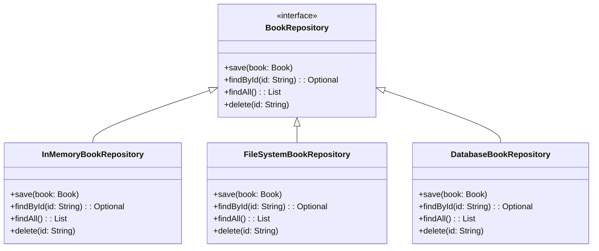

## Future-Proofing: Adding New Storage Backends

To ensure the system is scalable and easily extendable in the future, we’ve designed the repository layer to support multiple storage backends.

### FileSystem Storage:
In addition to in-memory storage, we have implemented a **`FileSystemBookRepository`** as a stub for file-based storage. This repository simulates saving and loading data from a file. In the future, it can be extended to serialize data into formats like JSON or XML, allowing the system to persist data across sessions.

### Class Diagram:
The updated class diagram now includes the new `FileSystemBookRepository` as one of the possible storage backends. Future implementations, such as a **DatabaseBookRepository**, can be easily added to the system by extending the repository interface and updating the `RepositoryFactory`.

By using the **Factory Pattern**, we can easily switch between different storage solutions without modifying the core application logic.

