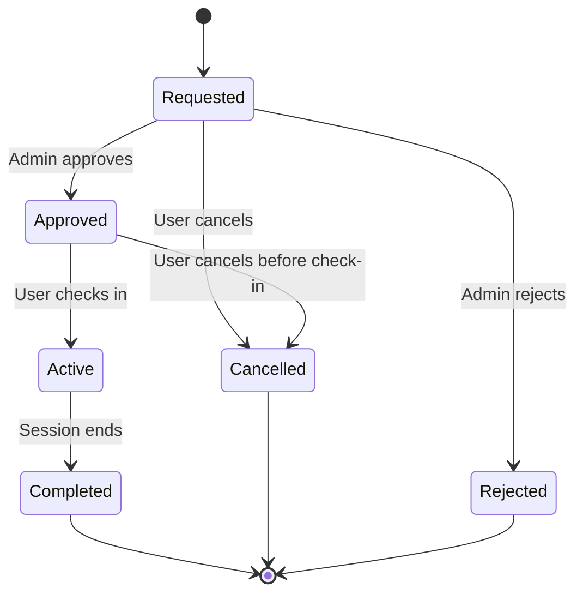
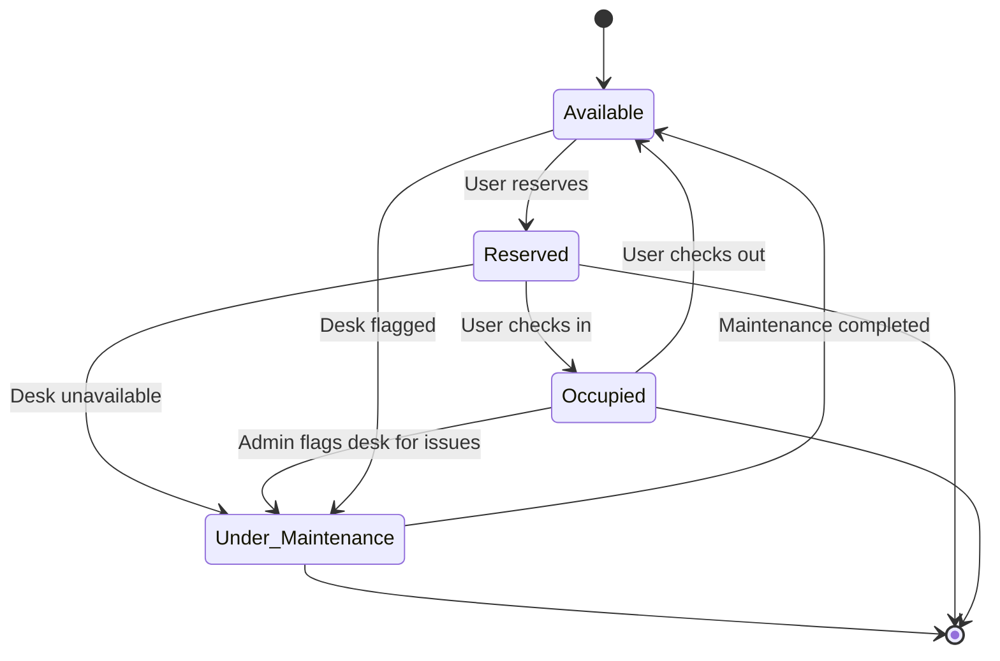
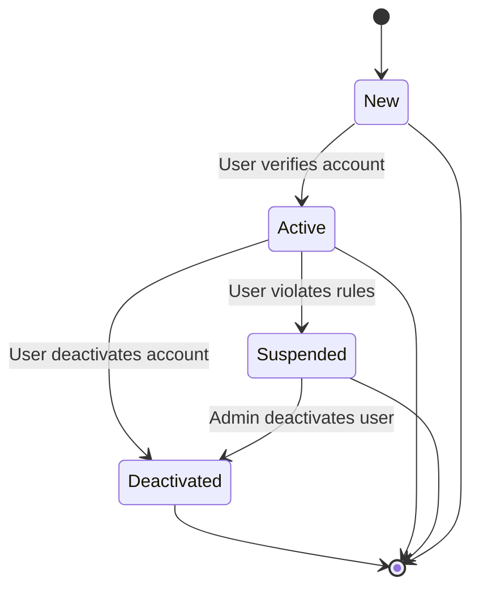
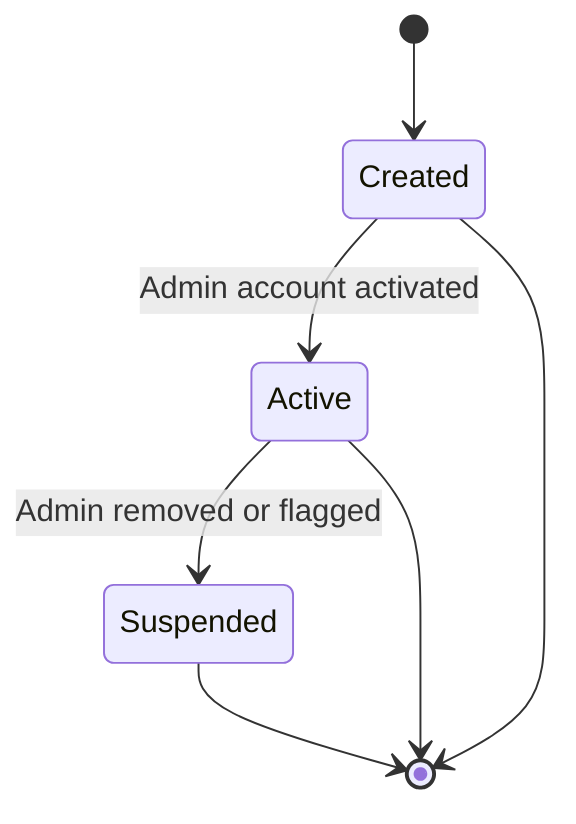
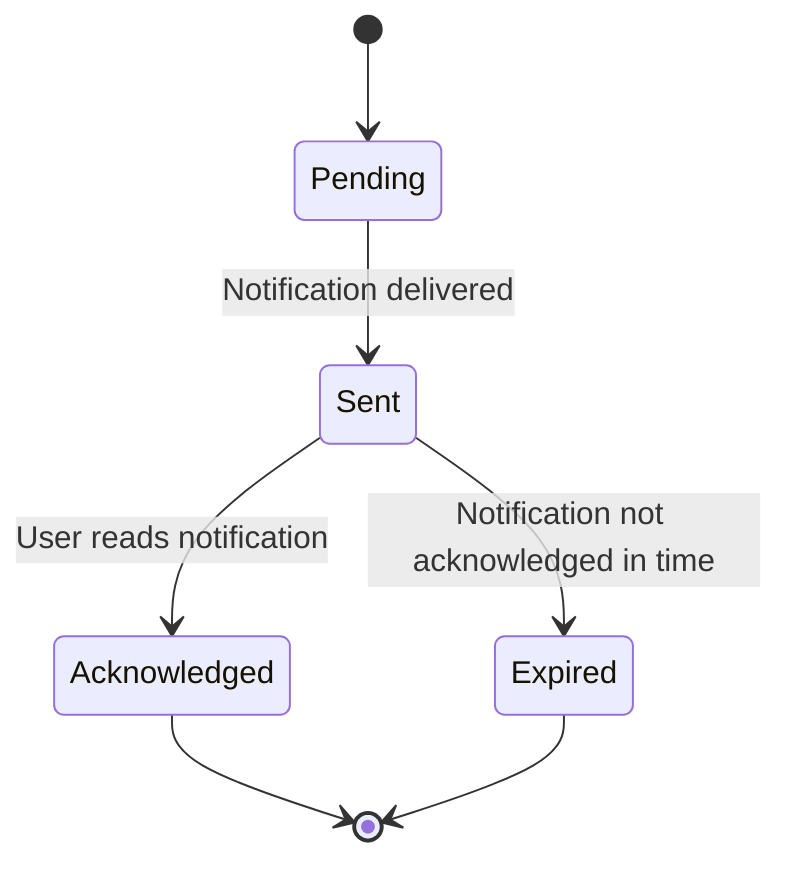
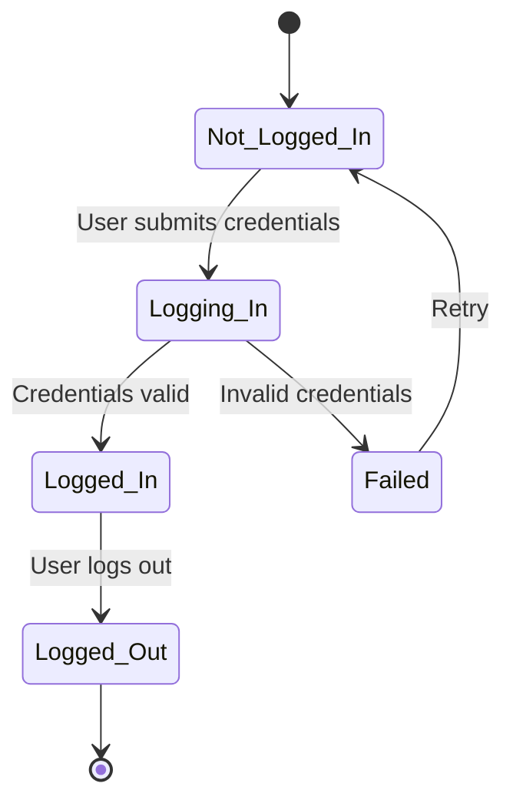
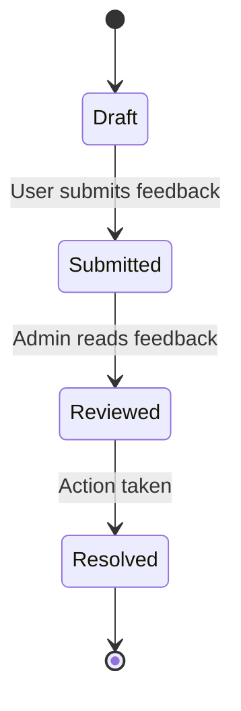
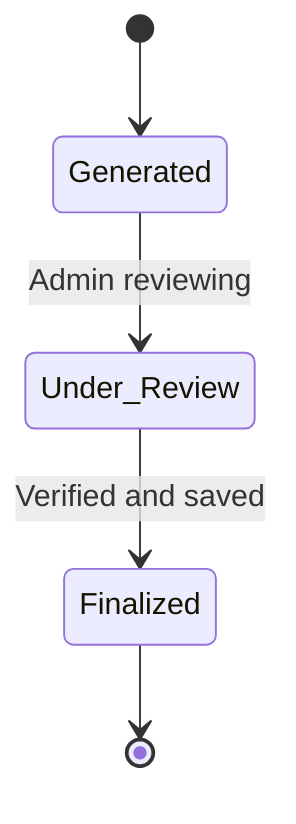

# State Transition Diagrams - Library Desk Booking System

This document contains the **state transition diagrams** for the objects in the Library Desk Booking System, showing how each object transitions through different states based on events.
 
---

## 1. **Booking Object**

# Key States and Transitions
Requested

**Description**: The booking is in the initial requested state after a user has made a booking. The request is awaiting approval from the admin.

Transitions:

Requested --> Approved: The admin approves the booking request.

Requested --> Rejected: The admin rejects the booking request.

Requested --> Cancelled: The user cancels the booking request before admin approval.

Approved

**Description**: The booking has been approved by the admin and is now eligible to be activated by the user.

Transitions:

Approved --> Active: The user checks in and the booking becomes active.

Approved --> Cancelled: The user cancels the booking before checking in.

Active

**Description**: The booking is active, indicating that the user has checked in and the booking is now in progress (e.g., the session is ongoing).

Transitions:

Active --> Completed: The session ends and the booking is marked as completed.

Completed

**Description**: The booking has reached its conclusion. The session has ended and no further actions can be taken.

Transitions: This is the terminal state, represented by [*].

Cancelled

**Description**: The booking has been canceled either by the user before admin approval or after approval but before check-in.

Transitions: This is also a terminal state, represented by [*].

Rejected

**Description**: The booking was rejected by the admin and cannot proceed further.

Transitions: This is a terminal state, represented by [*].

How the Diagram Maps to Functional Requirements
FR-001: User can make a booking request.

Mapping: The Requested state represents the user’s initial booking request, which is pending approval from the admin.

FR-002: Admin can approve or reject a booking.

Mapping: The transitions from Requested --> Approved and Requested --> Rejected map to the admin's ability to either approve or reject a booking.

FR-003: User can cancel a booking request before approval.

Mapping: The transition Requested --> Cancelled represents the ability for the user to cancel their booking before it’s approved.

FR-004: Admin approval activates the booking for the user.

Mapping: The transition from Approved --> Active allows the user to check in once the admin has approved the booking.

FR-005: User can cancel the booking before check-in.

Mapping: The Approved --> Cancelled transition allows the user to cancel their booking after it’s been approved but before they check in.

FR-006: Booking completes when the session ends.

Mapping: The transition from Active --> Completed represents the conclusion of the session, marking the booking as complete.

FR-007: Booking can be canceled at any time before check-in.

Mapping: The Requested --> Cancelled and Approved --> Cancelled transitions both cover this requirement. Users can cancel at any stage before check-in.

FR-008: Booking is rejected if not approved by admin.

Mapping: The Requested --> Rejected transition shows that if the admin rejects the booking, the booking can’t proceed any further.

## 2. Desk Object

# Key States and Transitions
Available: Desk is available for booking.

Reserved: Desk has been reserved by a user.

Occupied: Desk is in use by a user.

Under_Maintenance: Desk is flagged as unavailable for use.

Functional Requirements Mapping
Reserved → FR-001: Desk reservation is tracked.

Occupied → FR-004: Desk usage is monitored.

Under_Maintenance → FR-008: Admin can manage desk availability.

## 3. User Account Object

# Key States and Transitions
New: New user registration.

Active: Verified and active user.

Suspended: Account suspended due to violations.

Deactivated: User has deactivated their account.

# Functional Requirements Mapping
Active → FR-001: Active users can book desks.

Suspended → FR-009: Users violating terms are suspended.

Deactivated → FR-010: Users can deactivate their accounts.

## 4. Admin Account Object

# Key States and Transitions
Created: Admin account created.

Active: Admin has full privileges.

Suspended: Admin account is suspended or flagged.

# Functional Requirements Mapping
Active → FR-003: Admins can approve bookings and manage desk availability.

Suspended → FR-011: Admin roles can be suspended.

## 5. Notification Object

# Key States and Transitions
Pending: Notification created by the system.

Sent: Notification delivered to the user.

Acknowledged: User reads the notification.

Expired: Notification expired without being read.

# Functional Requirements Mapping
Sent → FR-006: Users are notified about booking confirmations and cancellations.

Acknowledged → FR-012: User reads and acknowledges notifications.

## 6. Login Session Object

# Key States:
Logged_Out, Logging_In, Logged_In, Timeout

# Transitions:

Logged_Out → Logging_In: Login process begins

Logging_In → Logged_In: Successful login

Logging_In → Logged_Out: Login failed

Logged_In → Logged_Out: User logs out

Logged_In → Timeout → Logged_Out: Inactivity logout

# Functional Requirements Mapping:

FR-013: User authentication

FR-014: Session timeout handling

FR-006: Notifications on actions

FR-012: Notification acknowledgment

# 7. Feedback Object

# Key States:
Draft, Submitted, Reviewed, Resolved

# Transitions:

Draft → Submitted: User submits

Submitted → Reviewed: Admin reads

Reviewed → Resolved: Action completed

# Functional Requirements Mapping:

FR-015: Submit feedback

FR-016: Admin reviews feedback

FR-017: Track resolution

# 8. Report Object

# Key States:
Generated, Under_Review, Finalized

# Transitions:

Generated → Under_Review: Admin starts checking

Under_Review → Finalized: Final confirmation

# Functional Requirements Mapping:

FR-018: Report generation

FR-019: Admin report review

FR-020: Finalization for records

