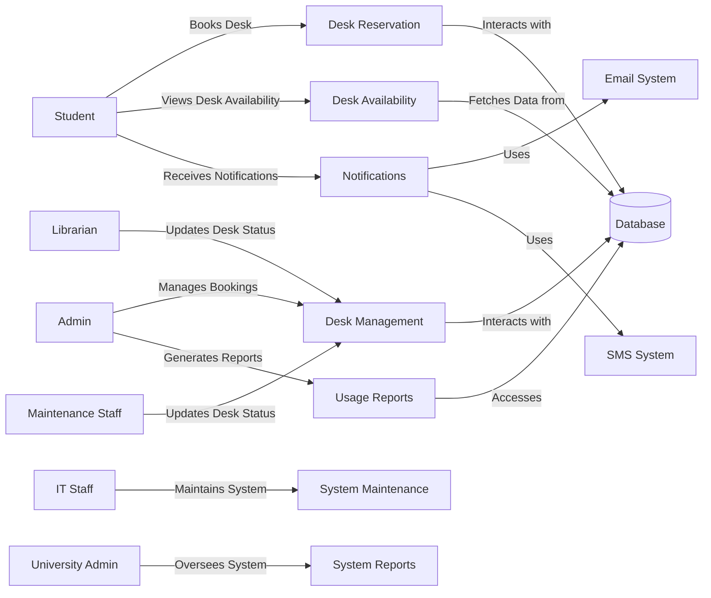

# Library Desk Booking System Use Case Diagram

```mermaid
graph LR
    Student[Student] -->|Books Desk| DeskReservation[Desk Reservation]
    Student -->|Views Desk Availability| DeskAvailability[Desk Availability]
    Student -->|Receives Notifications| Notifications[Notifications]
    Admin[Admin] -->|Manages Bookings| DeskManagement[Desk Management]
    Admin -->|Generates Reports| UsageReports[Usage Reports]
    Librarian[Librarian] -->|Updates Desk Status| DeskManagement
    ITStaff[IT Staff] -->|Maintains System| SystemMaintenance[System Maintenance]
    MaintenanceStaff[Maintenance Staff] -->|Updates Desk Status| DeskManagement
    UniversityAdmin[University Admin] -->|Oversees System| SystemReports[System Reports]
    DeskReservation -->|Interacts with| Database[(Database)]
    DeskAvailability -->|Fetches Data from| Database
    DeskManagement -->|Interacts with| Database
    Notifications -->|Uses| EmailSystem[Email System]
    Notifications -->|Uses| SMSSystem[SMS System]
    UsageReports -->|Accesses| Database

```
