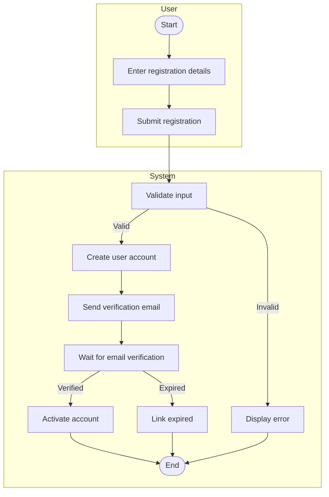
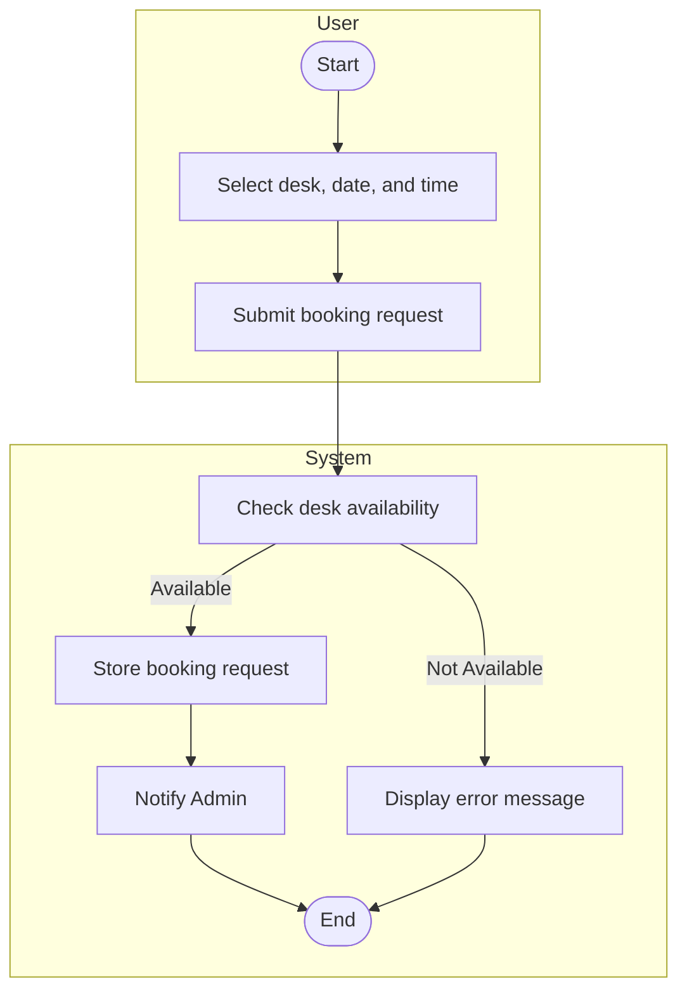
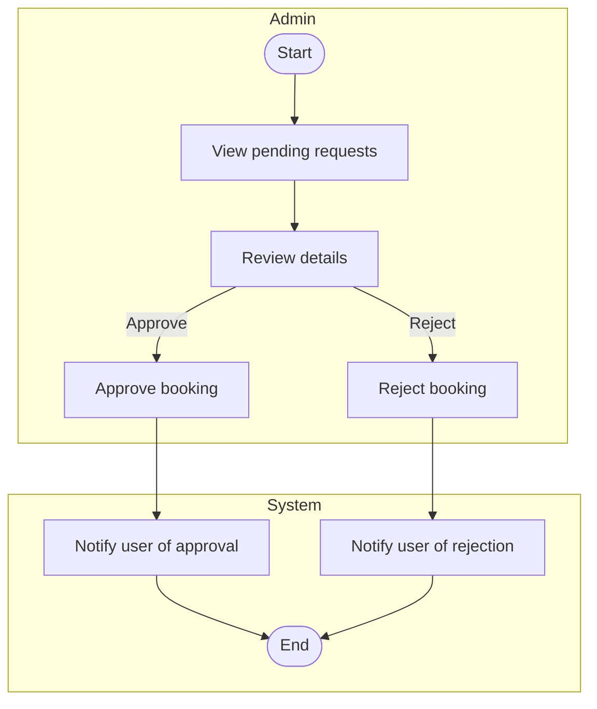
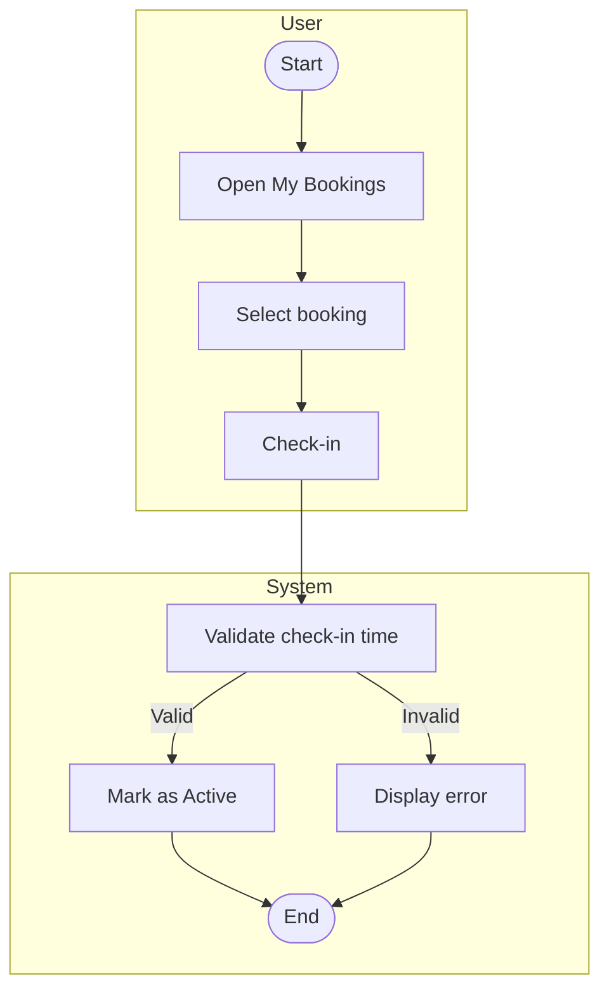
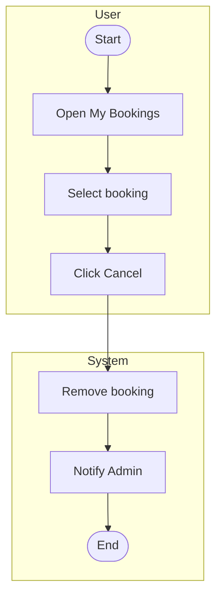
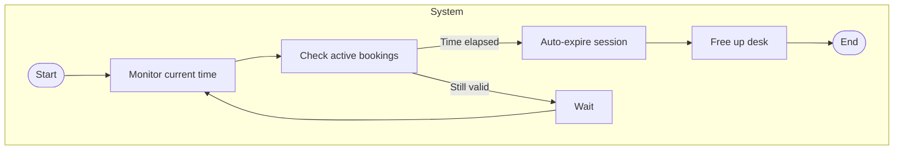
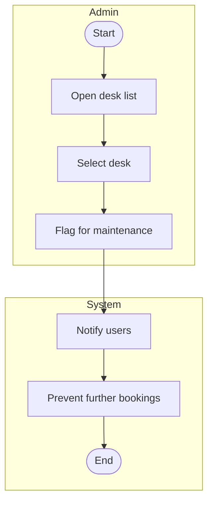
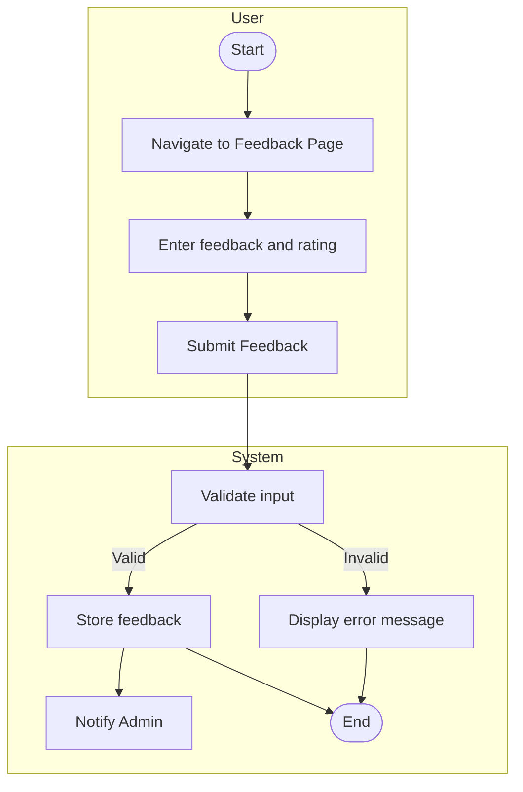

# 1. User Registration

**Explanation:** This workflow ensures secure and verified user registration. Stakeholders (admins) benefit from spam prevention and valid user data collection.
## 2. Desk Booking Request

**Explanation:**
Ensures real-time desk availability and quick feedback for users. Stakeholders benefit from efficient resource usage and reduced booking errors.

## 3. Admin Approves Booking

**Explanation:**
Admins maintain control over desk usage while users are kept informed, addressing communication and accountability concerns.

## 4. User Check-In

**Explanation:** Enforces time-bound desk usage, avoiding no-shows and increasing efficient utilization. Meets librarian needs for real-time status updates.

## 5. User Cancels Booking

**Explanation:**
 Gives users control over bookings while notifying admins for inventory updates. Supports flexibility and efficient desk turnover.

## 6. Booking Auto Expiry

**Explanation:**
Automatically frees desks not checked into. Enhances resource availability and supports auto-scaling needs for the system.

## 7. Admin Flags Desk for Maintenance

**Explanation:**
Ensures faulty desks aren’t booked, maintaining user safety and hardware quality. Helps librarians address user complaints efficiently.
## 8. Submit Feedback

**Explanation:**

This workflow allows users to communicate their experiences with the system. Feedback is validated, stored, and sent to administrators. This meets stakeholder concerns such as system usability tracking and identifying areas for improvement. The diagram includes decision logic (valid/invalid feedback) and shows the user-system interaction clearly. It also supports librarians' and developers' need for real-time feedback monitoring and quality assurance.
